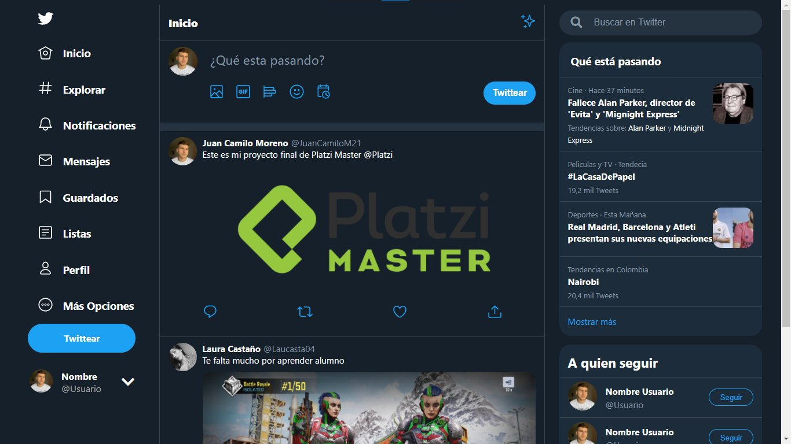

# React Twitter Clone

firebase and CSS, BEM, SAS tecnologies
This project is a Twitter clon in React JS with firebase and CSS, BEM, SAS technologies to add its greatest possible style and bring it closer to its original version.

## Start🛰

For see this proyect is necessary download the file .ZIP or do fork of this proyect and run command npm start

## Install ⚙

    git clone git@github.com:JuanCamiloM21/React-Twitter-Clon.git
    npm install

## Preview 👀

## Demo

[React-Twitter-Clon](https://juancamilo21.github.io/React-Twitter-Clon/)

## Tecnologies 💻

- HTML
- CSS
- CSS Grid
- Javascript
- BEM
- REACT JS
- SASS

## Author 🙋🏼‍♂️

- [Juan Camilo Moreno Gómez](https://github.com/JuanCamiloM21)

## Thanks 👏🏽

- Ana Belisa - Coach 👩🏽‍🏫
- Platzi Master

1% Talent 🧠 99% Passion 👨🏼‍💻❤️
